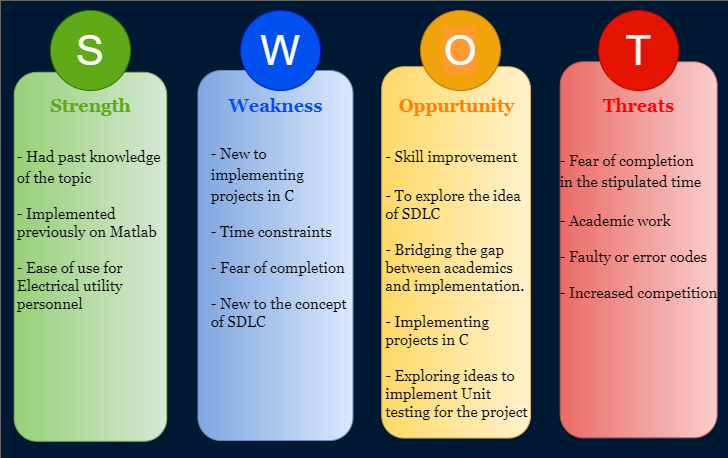

# Requirements

## Introduction
--- 

* A Transmission line is a specialized cable designed to conduct Electromagnetic waves in a contained manner. It is used for the transmission of electric power from the generating station to various distribution units. It also connects one power system to another. It transmits the wave of Voltage and Current from one end to another. The Performance analysis as well as the Fault analysis is the major concerned topic concerning any Transmission Line. 

* This projects deals with finding out Regulation and Efficiency of a Short Transmission Line. It also computes Unsymmetrical Fault analysis of the considered Transmission line.  

## Research

### Performance analysis of Transmission Line 
---

The term performance includes the calculation of sending end voltage, sending end current, sending end power factor, power loss in the lines, Load rating, power transferred, efficiency of transmission and regulation. Performance calculations are helpful in system planning.

* Voltage regulation is defined as the change in the magnitude of the voltage between the sending and receiving ends of the transmission line.

* The efficiency of transmission lines is defined as the ratio of the input power to the output power. 

### Fault analysis of a Transmission Line
---

A fault in a circuit is a failure that interferes with the normal flow of current. Fault analysis is an essential tool for the determination of short-circuit currents that result from different fault phenomena. Hence this analysis is a crucial part of the operation of power systems. Short circuit faults can be classified as Symmetrical and Unsymmetrical faults

* #### Symmetrical fault 

A three phase symmetrical fault is caused by application of three equal fault impedances Zf to the three phases. Since the three phases are equally affected, the system remains balanced.

* #### Unsymmetrical Fault

Faults in which the balanced state of the network is disturbed are called unsymmetrical or unbalanced faults. There are four major types of faults which occur in a Transmission Line
* Single Line to Ground Fault (SLG)
* Line to Ground Fault (LG)
* Double Line to Ground Fault (LLG) 

### Working of the tool
---

A Transmission line acts as a connection between Generating station and Distribution unit. An Electrical utility personnel will find the best use of this tool for determining the performance level and the fault level of a Transmission line. At any given time, upon the input given by the user to the system with respect to load, power factor, recieving end voltage, resistance and reactance of a transmission line, the personnel will be given the Performance level i.e., the Regulation and Efficiency of a Transmission line. In addition to this, for a specified fault condition the user will also be provided with the magnitude of Fault current of the considered Fault.  

## SWOT Analysis 
  

## 4W's and 1H 

### Who
---

* Can be utilised by Electrical Utility staff to know the various analysis level of a transmission line. 

### What
---

* An application which takes in all the parameters of a Transmission line and gives out output as required to the user.

### When
---

* As and when to determine Performance and Fault level of a Transmission line under unfavourable conditions.

### Where
---

* In an Electrical substation for the help of Electrical Utility personnel

### How
---

* The user gives input to a file which will be read into the tool and stored to variables. These stored values are used to compute the various performance evaluation terms which are considered.   

## Detailed Requirements 

### High level requirements
---

| ID | Description | Status |
| --- | --- | --- |
| HR01 | User should be able to read data from file | Implemented |
| HR02 | User should be able to modify the data in the file | Implemented |
| HR03 | If the text file is not found, should raise an issue | Implemented |

### Low level requirements
---

| ID | Description | Status |
| --- | --- | --- |
| LR01 | The data will be stored in .txt file.  User reads the data and stores in respective variables for future requirement. | Implemented|
| LR02 | The user can modify the values of paramteres   of a considered transmission line according to the requirements of the load.   At any considered time period the user can modify the   changing parameters and feed it to the tool | Implemented |
| LR03 | If the text file is not found or the data is not entered in text file   print the error message | Implemented |

