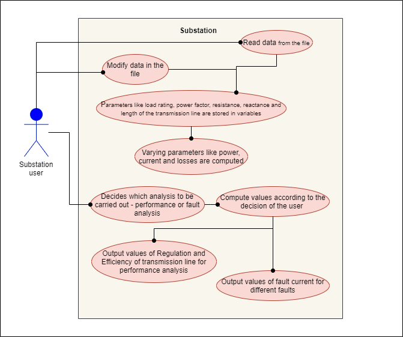
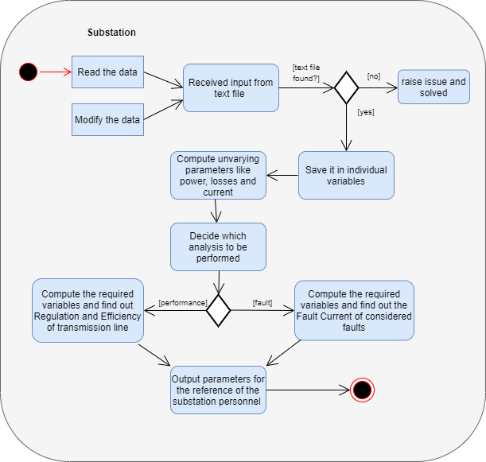

# Behaviour diagrams

## Use case diagram
---

* The Use case diagram for the program is as shown below which is used to describe set of actions a system or a subject can perform.  

  

## Activity diagram
---

* The Activity diagram for the program is as shown below which emphasizes on the sequence and control of the flow of the project.  

