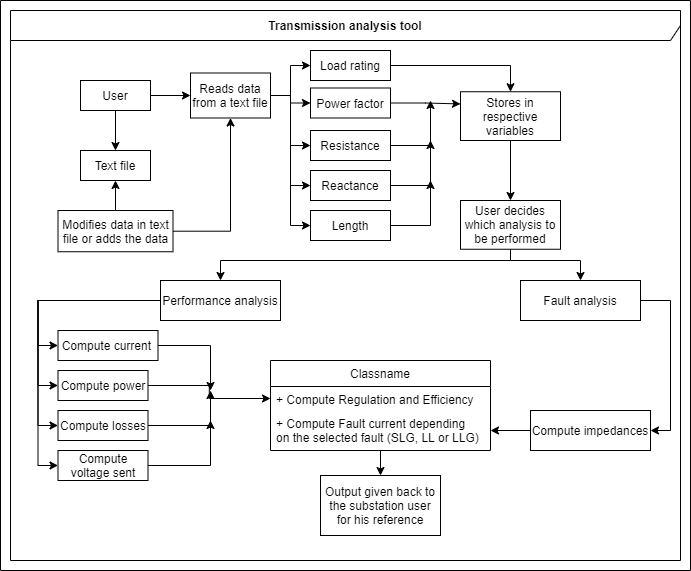

# Structure diagrams

## Class diagram
---

* Class diagram for the project is as shown. It shows structure of the designed system and the subsystem.   

  

## Composite diagram
---

* Composite diagram for the project is as shown below. It depicts the internal structure of the system.  

