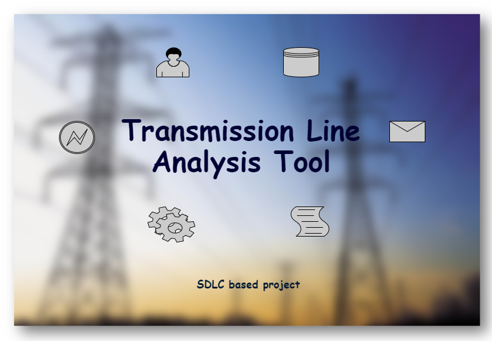

# Applied SDLC using C language

  

# Folder structure
| Folder | Description |
| --- | --- |
| 1_Requirements | Detail description about the project and requirements |
| 2_Architecture | UML diagrams detailing the project is given |
| 3_Implementation | Code, documentation and test cases |
| 4_TestPlanAndOutput | High level and low level test plans of the project | 
| 5_Report | |
| 6_ImagesAndVideos | Images relating to the project are added |
